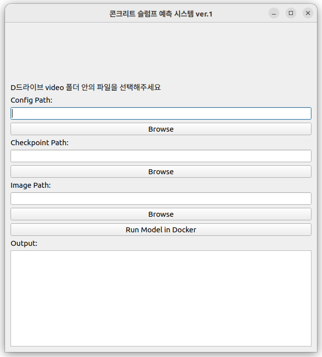

# Inference_App

Concrete slump predict system. 

# How to use

You can put the logo on the top.  
Please change logo path to your logo image.(.jpg or .png)  

Config Path refers to your model script.  
If you don't apply any changes, the C3D model will be used as the default.   
Checkpoint Path refers to the file containing your trained parameters.(e.g., .pth)  
If you don't apply any changes, the 240104Seoseoul_ending16frames training parameter will be used as the default.   
Image Path refers to the path of the video for which you want to predict the slump value.  
If you don't apply any changes, one of the 240104Seoseoul_ending16frames video will be used as the default.   

You can changes the paths by clicking the Browse button and selecting your file.    

After selecting your files, press the 'Run Model in Docker' button,and the slump prediction will be displayed in the Output Box.

Before run in the docker, need to start ssh protocol to connect.

in the container's terminal.
passwd root /// make password
service ssh start /// start ssh connection

after restart container, ssh is not automatically started.
So you need to restart ssh service manually.
